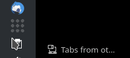

# tailscaler

An unofficial tailscale notification icon for !windows.

Works reasonably well on KDE - probably works on other DEs (untested).

Should be published standalone, so _in theory_ you shouldn't need dotnet
installed to run the app, but you will need dotnet sdk 8.0 to build.

# usage

Before running the first time, to enable your user as a tailscale operator,
please run:
```
sudo tailscale set --operator=$USER
```

from a console. Tailscaler runs in the system tray, right-click to interact.
If authorization is required (ie, no login, or auth has expired), you should
have the tailscale auth web page open in your browser, and after authentication,
you should see the tailscale icon settle down into "connected" mode:


Whilst tailscaler is busy, the icon should animate:




# disclaimer
Tailscaler is a "hack for me" project. It works reasonably well, but quite
possibly may have issues. If you find strange behavior, please raise an issue
on GitHub. If possible, please run tailscaler from a console and report back
any logs.
